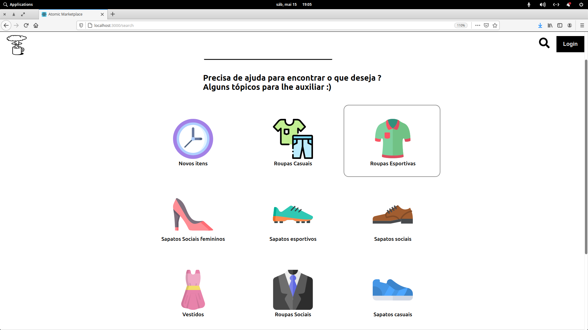

<h1 align='center'>Atomic Marketplace</h1>

## Para testar o projeto é necessario ter:

- Node.js
- SGBD (sistema gerenciador de banco de dados) de sua preferencia, como postgres, mysql ou outro
- Algum editor de codigo de sua preferencia

### Para rodar o backend: 

- abra a pasta do projeto em seu editor de codigo
- crie um arquivo ".env" e siga como parametro o ".env.example" que ira dizer quais campos deve colocar e como deve preenche-los
- abra o terminal, cmd ou powershell nessa pastas, e escreva "npm install"
- apos terminar a operação de install rode "node ace serve run" e espere o servidor carregar (ignore os erros, pois sao erros de linting)
- apos o servidor carregar, cancele utilizando "ctrl + c"
- rode o comando "node ace migration:run" e espere terminar
- depois rode "npm start"

### para rodar o frontend:

- rode todos os passos do backend
- entre na pasta "web" em seu terminal, cmd ou powershell
- rode npm install
- e depois rode npm start
